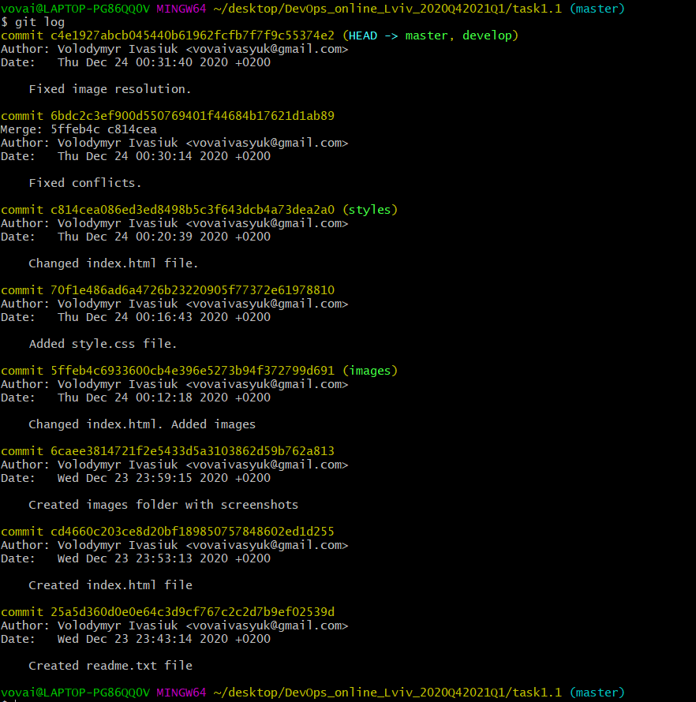
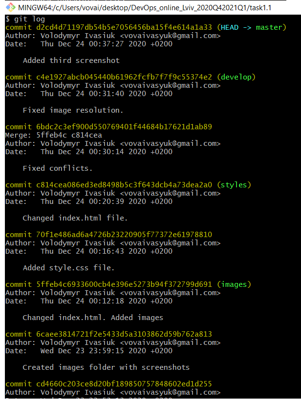
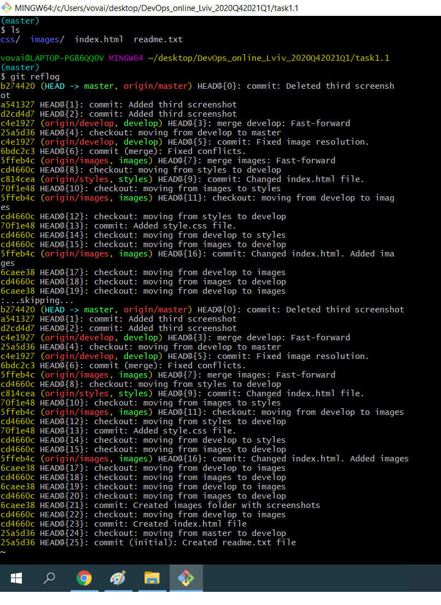

# DevOps?
DevOps is a combination of development (DEV) and operation (OPS). It is an association of people and processes that constantly give benefits to customers. DevOps aims to continuously test, develop new features and updates to increase reliability and security, monitor, and provide a fast software development cycle. 

# Screenshots!

