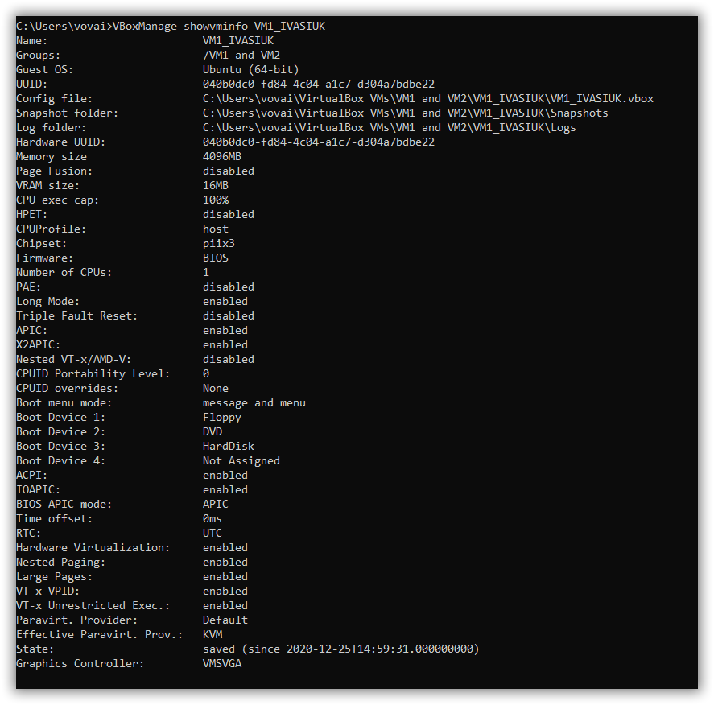
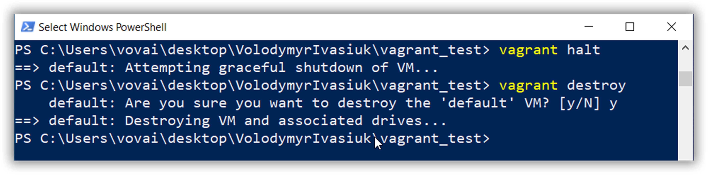

# 1. What are the most popular hypervisors for infrastructure virtualization?
	
	 Microsoft Hyper-V, Citrix XenServer, VMware ESXi,  Red Hat Enterprise Virtualization (RHEV)

# 2. Briefly describe the main differences of the most popular hypervisors.

# Red Hat Enterprise Virtualization (RHEV)

Network bonding, VLAN, and 10GB
Live migration, policy-based workload balancing, high availability, power saving, cluster maintenance, image management, templating, thin-provisioning, and event monitoring
Hosts support up to 160 cores and 2 TB of RAM. Guests support up to 64 vCPUs and 512 GB of RAM
Self Service user portal
Reporting and monitoring, detailed historical reporting capabilities, monitor historical usage, trending, quality of service

# Citrix XenServer
Conversion tools
Integration System Center Virtual Machine Manager
Snapshot and revert
XenCenter Management Console (even in the free edition)
Live migration (even in the free edition)
Live storage migration
Distributed virtual switch
High availability
Power management
Memory optimization
Monitoring and alerting

# VMware ESXi
Memory over commitment
High availability (called vSphere HA)
vMotion
Storage vMotion (svMotion)
vSphere Data Protection (for backup and recovery)
vSphere Replication
vShield Endpoint protection (the option to use agentless anti-virus solutions)
Hot add of memory and hot plug for CPU
Fault tolerance (FT) for availability
Distributed resource scheduler (DRS) for VM “load balancing” (effectively)
Distributed power management (DPM), consolidates VMs with vMotion and shuts down hosts to save power
Distributed virtual switch (dvSwitch)
Storage I/O control (SIOC) and network I/O control (NIOC)
Host profiles
Autodeploy
Storage distributed resource scheduler (SDRS)
Profile-driven storage
Single root I/O virtualization (SR-IOV)
Web-based management and new vCenter virtual appliance deployment
vCenter Single Sign On (SSO)
vCenter Operations Manager Foundation Edition
Optional features include Site Recovery Manager (SRM) for disaster recovery, vCenter Operations Manager Std/Adv, vCloud Director, vCloud Suite, VMware Horizon Suite, and more
Scale up to 512 VMs per host, up to 2048 vCPUs per host, up to 64 vCPUS and 1TB of vRAM per VM

# Microsoft Hyper-V
Live migration
Storage migration
VM Replication (Replica)
Dynamic memory
Extensible virtual switch
High availability
Scale up to 320 logical processors, 4TB of memory, 2,048 virtual CPUs per host, 64 vCPUs per VM, 1TB of memory per VM, and 64 nodes / 8000 VMs per cluster
Virtualization rights to run a specific number of Windows VMs without purchasing additonal licenses (2 Windows OS rights are included in Standard edition and an unlimited number are included in datacenter)

# Screenshots!

