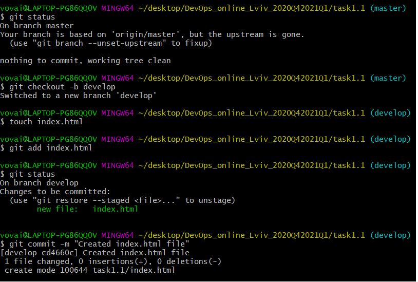
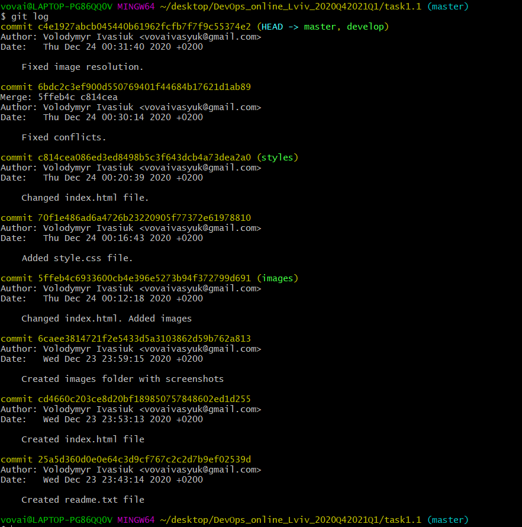
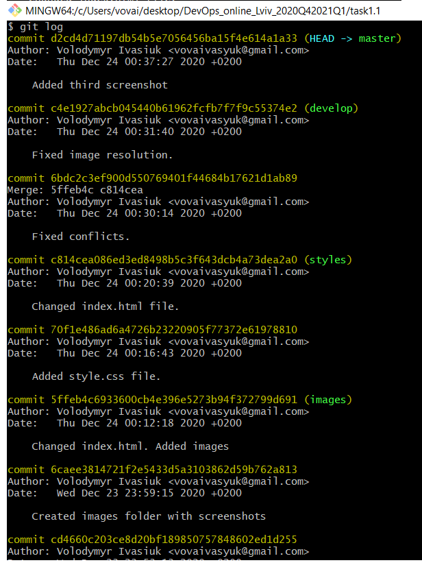
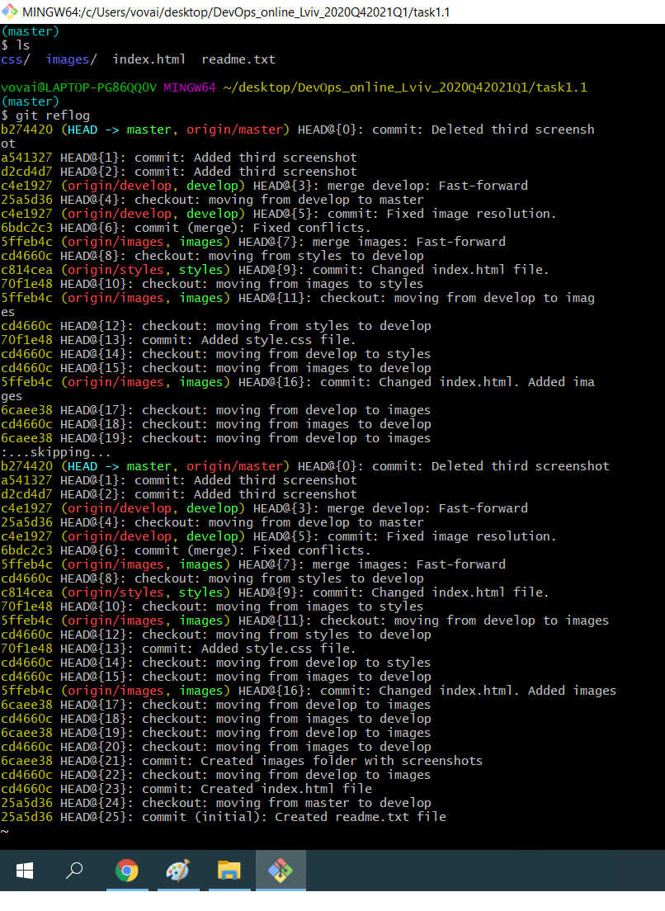

# DevOps?
DevOps - це поєднання розробки (DEV) та експлуатації (OPS). Це об'єднання людей і процесів, які постійно надають переваги клієнтам. Метою DevOps є неперервне тестування, розробка нових функцій і оновлень для підвищення надійності та безпеки, моніторинг, а також забезпечення швидкого циклу розробки програмного забезпечення.

# Screenshots!

